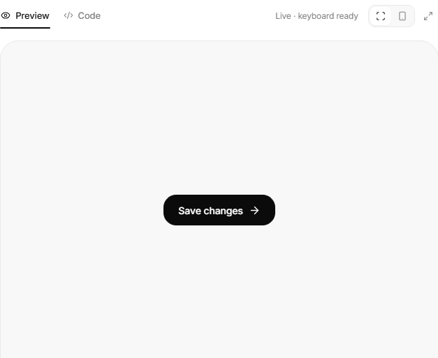
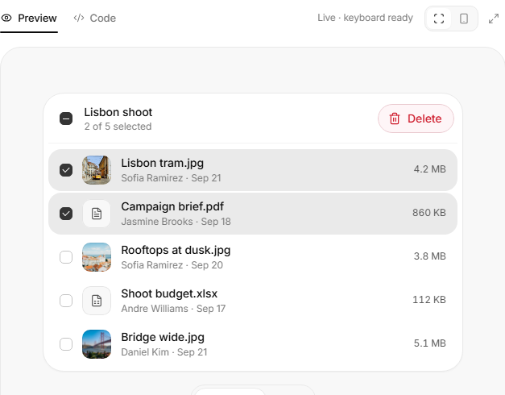

# Librería UI de EmpleoTecnia

Componentes y patrones de interfaz que al equipo le gustaron, porteados a nuestro stack
(Next.js, React, Tailwind v4, `motion`, Lucide) y pintados con los tokens de cada app.
Las apps son ciudades de un mismo país: comparten el carácter de cada pieza —forma,
movimiento, interacción— y cada una pone su color, su radio y su tipografía.

## Cómo se usa

Desde Claude Code, parado en cualquier carpeta de `Plataformas`:

- `/ui-buscar navbar sutil para el perfil` — muestra hasta cinco candidatos con captura.
- `/ui-usar <slug>` — parado en una app: copia el componente a `src/components/ui/` y
  propone el mapeo de tokens si la app no lo tiene.
- `/ui-agregar <url | descripción | captura>` — guarda algo que te gustó. Te pregunta
  qué te gustó y para qué lo usarías. Nada más.

Para verlo vivo: `npm install && npm run dev` y abrí `http://localhost:3100` (puerto
propio, para no chocar con la app que tengas corriendo en el 3000). El selector de
arriba pinta cada componente con los tokens de `mi`, `etconecta`, `campus` o
`proyectos`.

## Para capturar (sólo quien agrega componentes)

`npm run capturar` saca `preview.png` y `preview.webp` de cada adoptado. Necesita dos
cosas que `npm install` no trae:

```
npx playwright install chromium
```

y **ffmpeg** en el PATH (`winget install Gyan.FFmpeg` en Windows, `brew install ffmpeg`
en macOS). Si falta alguna, el script lo dice antes de arrancar.

Los chequeos del repo: `npm run verificar` (tests + catálogo). En CI corre además
`verificar:ci`, que exige que lo generado esté commiteado.

## El contrato de tokens

Un componente adoptado usa sólo las 15 variables `--ui-*` de [`tokens.css`](tokens.css).
Tu app las mapea una vez a sus propios tokens, y listo.

## Catálogo

<!-- catalogo:inicio -->
6 entradas, 2 adoptadas.

- **[Componentes](components/)** (6): [buttons](components/buttons/) · [feedback](components/feedback/) · [forms](components/forms/) · [navigation](components/navigation/)

### Últimas que entraron

<table>
<tr>
<td width="33%" valign="top">
<a href="components/buttons/action-button/"></a><br><b><a href="components/buttons/action-button/">Botón con estado</a></b> · referencia<br>
<sub>Muy simple, pero tiene movimiento y la acción ahí mismo, sin depender de un label o mensajes fuera del botón: guardar, guardando, guardado.</sub><br>
<sub><a href="https://uiarc.dev/components/action-button">Ver original en Arc UI ↗</a></sub>
</td>
<td width="33%" valign="top">
<a href="components/buttons/confirm-morph/"></a><br><b><a href="components/buttons/confirm-morph/">Confirmar con deshacer</a></b> · referencia<br>
<sub>Para eliminar cosas de una lista está genial: el botón se transforma y te da la oportunidad de restablecer.</sub><br>
<sub><a href="https://uiarc.dev/components/confirm-morph">Ver original en Arc UI ↗</a></sub>
</td>
<td width="33%" valign="top">
<a href="components/buttons/hold-to-confirm/"></a><br><b><a href="components/buttons/hold-to-confirm/">Mantener para confirmar</a></b> · referencia<br>
<sub>Confirmar manteniendo apretado, sin pop-up: para eliminar algo importante pero no tan importante.</sub><br>
<sub><a href="https://uiarc.dev/components/hold-to-confirm">Ver original en Arc UI ↗</a></sub>
</td>
</tr>
<tr>
<td width="33%" valign="top">
<a href="components/feedback/status-mark/"></a><br><b><a href="components/feedback/status-mark/">Marca de estado</a></b> · adoptado<br>
<sub>Me gustó todo: el mismo círculo que se transforma de punteado a girando a tilde o cruz, y que tacha la etiqueta al terminar.</sub><br>
<sub><a href="https://reactbits.dev/micro/status-mark">Ver original en React Bits ↗</a> · <a href="https://empleotecnia.github.io/ui/c/feedback/status-mark/">Probarlo ↗</a></sub>
</td>
<td width="33%" valign="top">
<a href="components/forms/password-strength/"></a><br><b><a href="components/forms/password-strength/">Fuerza de contraseña</a></b> · adoptado<br>
<sub>Me gustó todo como está armado: las cuatro barras que se llenan, los requisitos que se van tildando con cuántos caracteres faltan, y el ojo que se tacha para mostrar la contraseña.</sub><br>
<sub><a href="https://uiarc.dev/components/password-strength">Ver original en Arc UI ↗</a> · <a href="https://empleotecnia.github.io/ui/c/forms/password-strength/">Probarlo ↗</a></sub>
</td>
<td width="33%" valign="top">
<a href="components/navigation/user-menu/"></a><br><b><a href="components/navigation/user-menu/">Menú de usuario</a></b> · referencia<br>
<sub>El desplegable con el formato y las opciones claras, el cambio de tonalidad del tema adentro y el cerrar sesión en otro color.</sub><br>
<sub><a href="https://uiarc.dev/components/user-menu">Ver original en Arc UI ↗</a></sub>
</td>
</tr>
</table>

<!-- catalogo:fin -->
