<!-- Generado por scripts/catalogar.mjs. No editar a mano. -->
# Componentes

- [buttons](buttons/) · 3
- [feedback](feedback/) · 1
- [fields](fields/) · 5
- [menus](menus/) · 3
- [pickers](pickers/) · 5
- [toggles](toggles/) · 1

<table>
<tr>
<td width="33%" valign="top">
 <b><a href="buttons/action-button/">Botón con estado</a></b> · adoptado 
Muy simple, pero tiene movimiento y la acción ahí mismo, sin depender de un label o mensajes fuera del botón: guardar, guardando, guardado. 
<a href="https://uiarc.dev/components/action-button">Ver original en Arc UI ↗</a> · <a href="https://empleotecnia.github.io/ui/c/buttons/action-button/">Probarlo ↗</a>
</td>
<td width="33%" valign="top">
 <b><a href="buttons/confirm-morph/">Confirmar con deshacer</a></b> · referencia 
Para eliminar cosas de una lista está genial: el botón se transforma y te da la oportunidad de restablecer. 
<a href="https://uiarc.dev/components/confirm-morph">Ver original en Arc UI ↗</a>
</td>
<td width="33%" valign="top">
 <b><a href="buttons/hold-to-confirm/">Mantener para confirmar</a></b> · referencia 
Confirmar manteniendo apretado, sin pop-up: para eliminar algo importante pero no tan importante. 
<a href="https://uiarc.dev/components/hold-to-confirm">Ver original en Arc UI ↗</a>
</td>
</tr>
<tr>
<td width="33%" valign="top">
 <b><a href="feedback/status-mark/">Marca de estado</a></b> · adoptado 
Me gustó todo: el mismo círculo que se transforma de punteado a girando a tilde o cruz, y que tacha la etiqueta al terminar. 
<a href="https://reactbits.dev/micro/status-mark">Ver original en React Bits ↗</a> · <a href="https://empleotecnia.github.io/ui/c/feedback/status-mark/">Probarlo ↗</a>
</td>
<td width="33%" valign="top">
 <b><a href="fields/mention-input/">Campo con menciones</a></b> · referencia 
Para etiquetar personas en un chat: la mención resalta muy bien en la conversación. 
<a href="https://uiarc.dev/components/mention-input">Ver original en Arc UI ↗</a>
</td>
<td width="33%" valign="top">
<a href="fields/number-field/">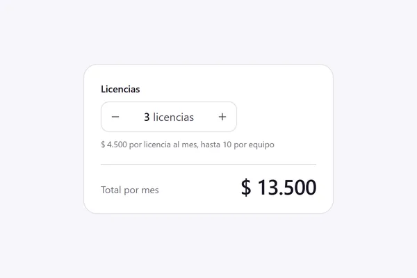</a> <b><a href="fields/number-field/">Campo numérico</a></b> · adoptado 
La dinámica: la alerta cuando llegás al máximo y cómo te va sumando el precio a medida que agregás. 
<a href="https://uiarc.dev/components/number-field">Ver original en Arc UI ↗</a> · <a href="https://empleotecnia.github.io/ui/c/fields/number-field/">Probarlo ↗</a>
</td>
</tr>
<tr>
<td width="33%" valign="top">
<a href="fields/rich-text-editor/">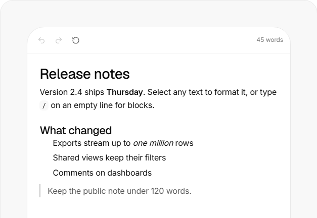</a> <b><a href="fields/rich-text-editor/">Editor de texto</a></b> · referencia 
No tiene las opciones fijas arriba: se van mostrando a medida que seleccionás una parte del texto. 
<a href="https://uiarc.dev/components/rich-text-editor">Ver original en Arc UI ↗</a>
</td>
<td width="33%" valign="top">
<a href="fields/password-strength/">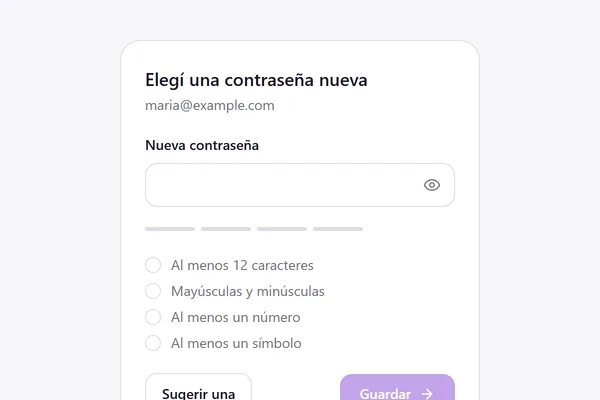</a> <b><a href="fields/password-strength/">Fuerza de contraseña</a></b> · adoptado 
Me gustó todo como está armado: las cuatro barras que se llenan, los requisitos que se van tildando con cuántos caracteres faltan, y el ojo que se tacha para mostrar la contraseña. 
<a href="https://uiarc.dev/components/password-strength">Ver original en Arc UI ↗</a> · <a href="https://empleotecnia.github.io/ui/c/fields/password-strength/">Probarlo ↗</a>
</td>
<td width="33%" valign="top">
<a href="fields/phone-input/">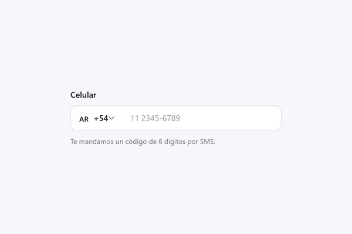</a> <b><a href="fields/phone-input/">Teléfono con país</a></b> · adoptado 
Elegir el código de país y escribir el número en un solo campo. El botón de probar no me gusta, lo quitaría. 
<a href="https://uiarc.dev/components/phone-input">Ver original en Arc UI ↗</a> · <a href="https://empleotecnia.github.io/ui/c/fields/phone-input/">Probarlo ↗</a>
</td>
</tr>
<tr>
<td width="33%" valign="top">
<a href="menus/select/">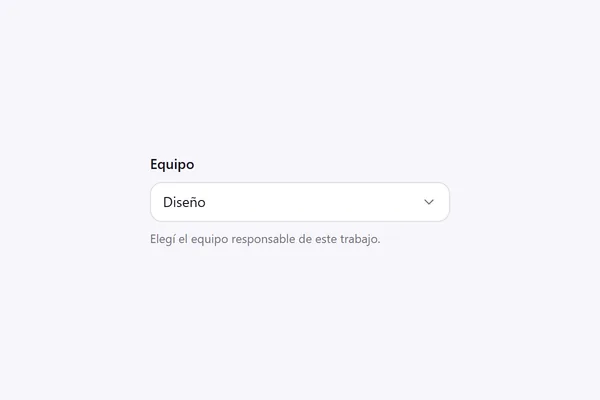</a> <b><a href="menus/select/">Desplegable</a></b> · adoptado 
Un desplegable simple pero con buena dinámica: buen reflejo al abrir y buen cambio de posición del ícono. 
<a href="https://uiarc.dev/components/select">Ver original en Arc UI ↗</a> · <a href="https://empleotecnia.github.io/ui/c/menus/select/">Probarlo ↗</a>
</td>
<td width="33%" valign="top">
<a href="menus/user-menu/">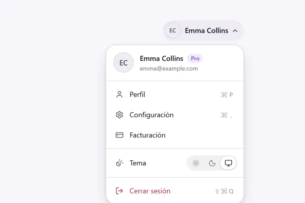</a> <b><a href="menus/user-menu/">Menú de usuario</a></b> · adoptado 
El desplegable con el formato y las opciones claras, el cambio de tonalidad del tema adentro y el cerrar sesión en otro color. 
<a href="https://uiarc.dev/components/user-menu">Ver original en Arc UI ↗</a> · <a href="https://empleotecnia.github.io/ui/c/menus/user-menu/">Probarlo ↗</a>
</td>
<td width="33%" valign="top">
<a href="menus/multi-select/">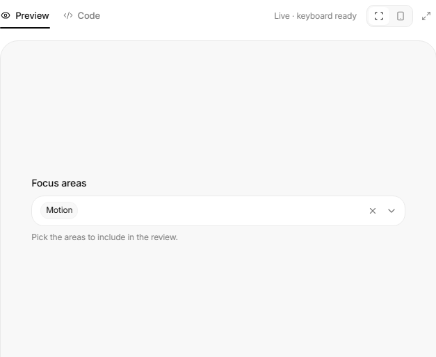</a> <b><a href="menus/multi-select/">Selección múltiple</a></b> · referencia 
Elegís sin checkbox, no te saca del desplegable cada vez que elegís uno y te va mostrando arriba lo que fuiste agregando. 
<a href="https://uiarc.dev/components/multi-select">Ver original en Arc UI ↗</a>
</td>
</tr>
<tr>
<td width="33%" valign="top">
<a href="pickers/slider/">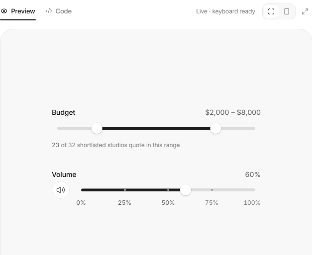</a> <b><a href="pickers/slider/">Deslizador</a></b> · referencia 
Buen movimiento y suma valor que te vaya mostrando el número al mover la barra. 
<a href="https://uiarc.dev/components/slider">Ver original en Arc UI ↗</a>
</td>
<td width="33%" valign="top">
<a href="pickers/signature-pad/">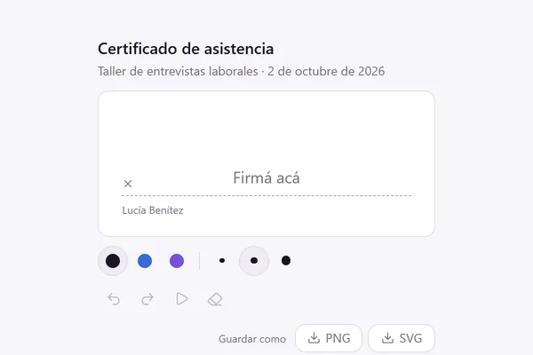</a> <b><a href="pickers/signature-pad/">Firma</a></b> · adoptado 
Si en algún momento hay que firmar algo, esto está genial: se dibuja la firma ahí mismo. 
<a href="https://uiarc.dev/components/signature-pad">Ver original en Arc UI ↗</a> · <a href="https://empleotecnia.github.io/ui/c/pickers/signature-pad/">Probarlo ↗</a>
</td>
<td width="33%" valign="top">
<a href="pickers/date-range-picker/">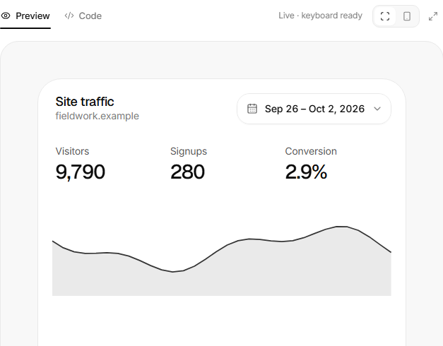</a> <b><a href="pickers/date-range-picker/">Rango de fechas</a></b> · referencia 
Me encanta para elegir el período de un gráfico específico, por ejemplo los inscriptos a los cursos. 
<a href="https://uiarc.dev/components/date-range-picker">Ver original en Arc UI ↗</a>
</td>
</tr>
<tr>
<td width="33%" valign="top">
<a href="pickers/color-picker/">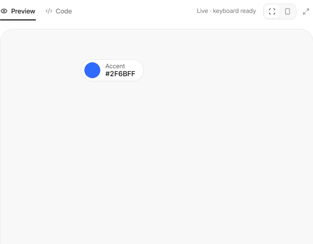</a> <b><a href="pickers/color-picker/">Selector de color</a></b> · referencia 
Está genial. Lo único que no tiene y le agregaría es poder elegir en RGB y RGBA. 
<a href="https://uiarc.dev/components/color-picker">Ver original en Arc UI ↗</a>
</td>
<td width="33%" valign="top">
<a href="pickers/file-dropzone/">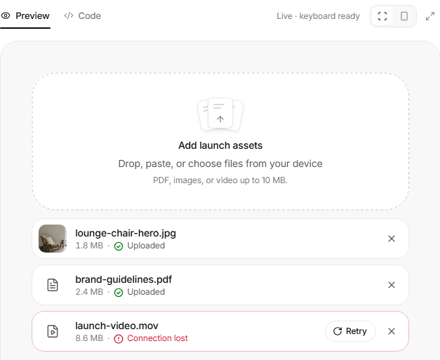</a> <b><a href="pickers/file-dropzone/">Zona de carga</a></b> · referencia 
Buenísimo para cuando hay que cargar archivos e imágenes arrastrando. 
<a href="https://uiarc.dev/components/file-dropzone">Ver original en Arc UI ↗</a>
</td>
<td width="33%" valign="top">
 <b><a href="toggles/billing-toggle/">Mensual o anual</a></b> · referencia 
Muy simple: mensual o anual, para cuando no hay que dar mucho detalle de los planes u opciones. 
<a href="https://uiarc.dev/components/billing-toggle">Ver original en Arc UI ↗</a>
</td>
</tr>
</table>
