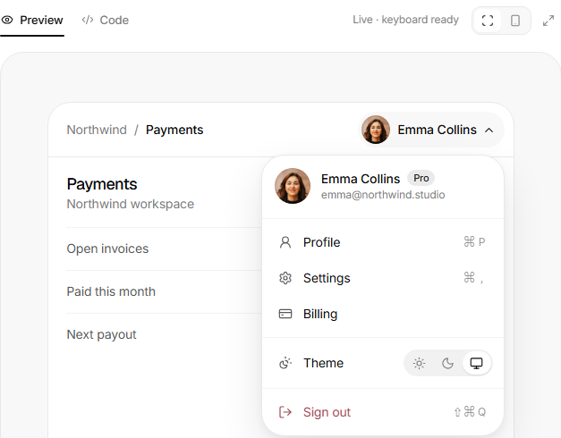

<!-- Generado por scripts/catalogar.mjs. No editar a mano. -->
# Componentes

- [buttons](buttons/) · 1
- [feedback](feedback/) · 1
- [forms](forms/) · 1
- [navigation](navigation/) · 1

<table>
<tr>
<td width="33%" valign="top">
 <b><a href="buttons/hold-to-confirm/">Mantener para confirmar</a></b> · referencia 
Confirmar manteniendo apretado, sin pop-up: para eliminar algo importante pero no tan importante. 
<a href="https://uiarc.dev/components/hold-to-confirm">Ver original en Arc UI ↗</a>
</td>
<td width="33%" valign="top">
 <b><a href="feedback/status-mark/">Marca de estado</a></b> · adoptado 
Me gustó todo: el mismo círculo que se transforma de punteado a girando a tilde o cruz, y que tacha la etiqueta al terminar. 
<a href="https://reactbits.dev/micro/status-mark">Ver original en React Bits ↗</a> · <a href="https://empleotecnia.github.io/ui/c/feedback/status-mark/">Probarlo ↗</a>
</td>
<td width="33%" valign="top">
 <b><a href="forms/password-strength/">Fuerza de contraseña</a></b> · adoptado 
Me gustó todo como está armado: las cuatro barras que se llenan, los requisitos que se van tildando con cuántos caracteres faltan, y el ojo que se tacha para mostrar la contraseña. 
<a href="https://uiarc.dev/components/password-strength">Ver original en Arc UI ↗</a> · <a href="https://empleotecnia.github.io/ui/c/forms/password-strength/">Probarlo ↗</a>
</td>
</tr>
<tr>
<td width="33%" valign="top">
 <b><a href="navigation/user-menu/">Menú de usuario</a></b> · referencia 
El desplegable con el formato y las opciones claras, el cambio de tonalidad del tema adentro y el cerrar sesión en otro color. 
<a href="https://uiarc.dev/components/user-menu">Ver original en Arc UI ↗</a>
</td>
</tr>
</table>
