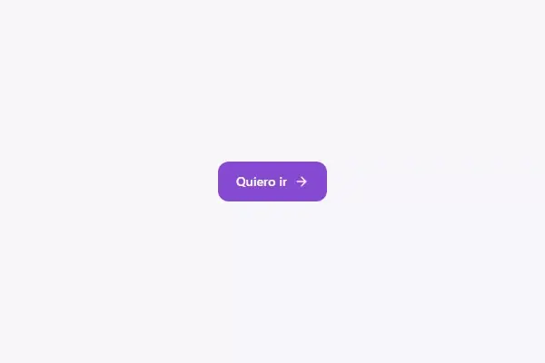

<!-- Generado por scripts/catalogar.mjs. No editar a mano. -->
# Componentes · botones

[← Componentes](../)

<table>
<tr>
<td width="33%" valign="top">
 <b><a href="boton-iman/">Botón imán</a></b> · adoptado 
Se corre hacia el cursor y vuelve con un resorte: se siente vivo sin gritar, y en el celular es un botón común.
</td>
</tr>
</table>
