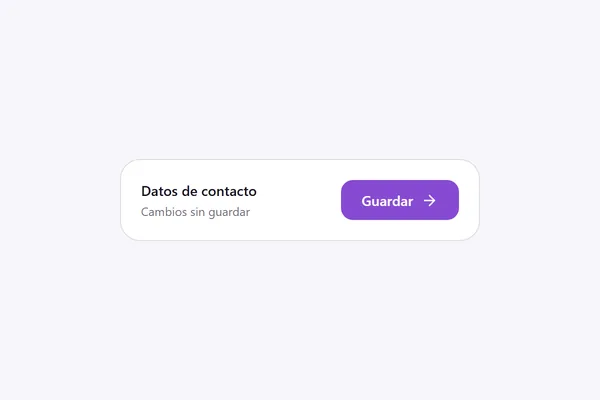
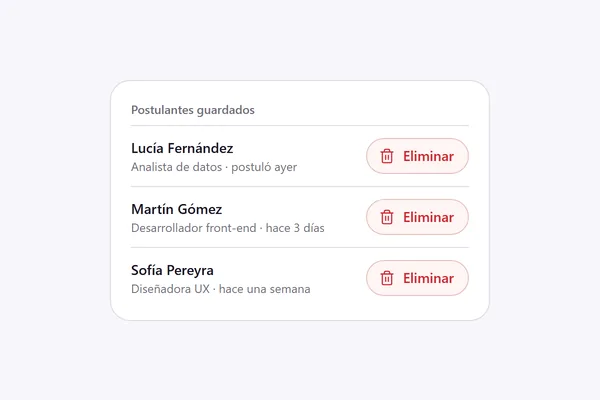
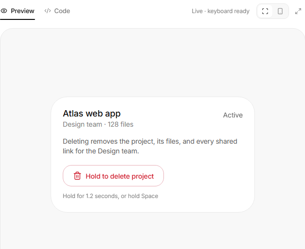

<!-- Generado por scripts/catalogar.mjs. No editar a mano. -->
# Componentes · buttons

[← Componentes](../)

<table>
<tr>
<td width="33%" valign="top">
 <b><a href="action-button/">Botón con estado</a></b> · adoptado 
Muy simple, pero tiene movimiento y la acción ahí mismo, sin depender de un label o mensajes fuera del botón: guardar, guardando, guardado. 
<a href="https://uiarc.dev/components/action-button">Ver original en Arc UI ↗</a> · <a href="https://empleotecnia.github.io/ui/c/buttons/action-button/">Probarlo ↗</a>
</td>
<td width="33%" valign="top">
 <b><a href="confirm-morph/">Confirmar con deshacer</a></b> · adoptado 
Para eliminar cosas de una lista está genial: el botón se transforma y te da la oportunidad de restablecer. 
<a href="https://uiarc.dev/components/confirm-morph">Ver original en Arc UI ↗</a> · <a href="https://empleotecnia.github.io/ui/c/buttons/confirm-morph/">Probarlo ↗</a>
</td>
<td width="33%" valign="top">
 <b><a href="hold-to-confirm/">Mantener para confirmar</a></b> · referencia 
Confirmar manteniendo apretado, sin pop-up: para eliminar algo importante pero no tan importante. 
<a href="https://uiarc.dev/components/hold-to-confirm">Ver original en Arc UI ↗</a>
</td>
</tr>
</table>
