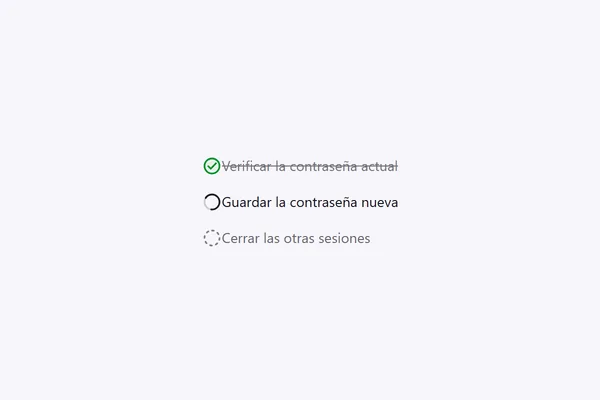

<!-- Generado por scripts/catalogar.mjs. No editar a mano. -->
# Componentes · feedback

[← Componentes](../)

<table>
<tr>
<td width="33%" valign="top">
 <b><a href="status-mark/">Marca de estado</a></b> · adoptado 
Me gustó todo: el mismo círculo que se transforma de punteado a girando a tilde o cruz, y que tacha la etiqueta al terminar.
</td>
</tr>
</table>
