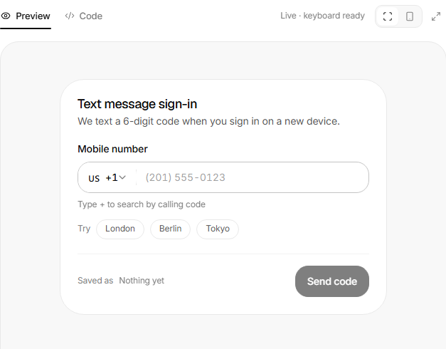

<!-- Generado por scripts/catalogar.mjs. No editar a mano. -->
# Componentes · fields

[← Componentes](../)

<table>
<tr>
<td width="33%" valign="top">
 <b><a href="mention-input/">Campo con menciones</a></b> · referencia 
Para etiquetar personas en un chat: la mención resalta muy bien en la conversación. 
<a href="https://uiarc.dev/components/mention-input">Ver original en Arc UI ↗</a>
</td>
<td width="33%" valign="top">
 <b><a href="number-field/">Campo numérico</a></b> · referencia 
La dinámica: la alerta cuando llegás al máximo y cómo te va sumando el precio a medida que agregás. 
<a href="https://uiarc.dev/components/number-field">Ver original en Arc UI ↗</a>
</td>
<td width="33%" valign="top">
 <b><a href="rich-text-editor/">Editor de texto</a></b> · referencia 
No tiene las opciones fijas arriba: se van mostrando a medida que seleccionás una parte del texto. 
<a href="https://uiarc.dev/components/rich-text-editor">Ver original en Arc UI ↗</a>
</td>
</tr>
<tr>
<td width="33%" valign="top">
 <b><a href="password-strength/">Fuerza de contraseña</a></b> · adoptado 
Me gustó todo como está armado: las cuatro barras que se llenan, los requisitos que se van tildando con cuántos caracteres faltan, y el ojo que se tacha para mostrar la contraseña. 
<a href="https://uiarc.dev/components/password-strength">Ver original en Arc UI ↗</a> · <a href="https://empleotecnia.github.io/ui/c/fields/password-strength/">Probarlo ↗</a>
</td>
<td width="33%" valign="top">
 <b><a href="phone-input/">Teléfono con país</a></b> · referencia 
Elegir el código de país y escribir el número en un solo campo. El botón de probar no me gusta, lo quitaría. 
<a href="https://uiarc.dev/components/phone-input">Ver original en Arc UI ↗</a>
</td>
</tr>
</table>
