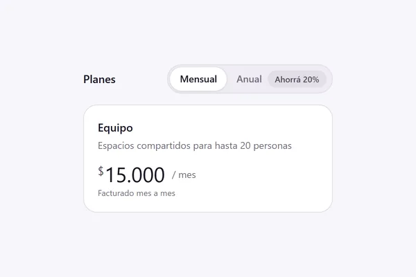

<!-- Generado por scripts/catalogar.mjs. No editar a mano. -->
# Componentes · toggles

[← Componentes](../)

<table>
<tr>
<td width="33%" valign="top">
 <b><a href="billing-toggle/">Mensual o anual</a></b> · adoptado 
Muy simple: mensual o anual, para cuando no hay que dar mucho detalle de los planes u opciones. 
<a href="https://uiarc.dev/components/billing-toggle">Ver original en Arc UI ↗</a> · <a href="https://empleotecnia.github.io/ui/c/toggles/billing-toggle/">Probarlo ↗</a>
</td>
</tr>
</table>
